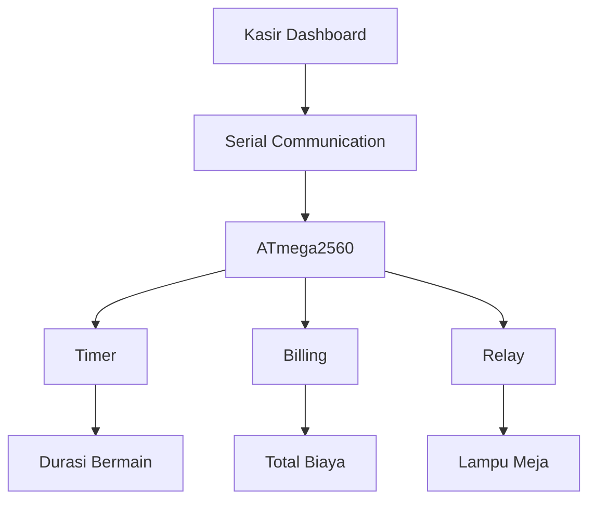

# 🎱 Smart Billiard Lighting & Billing System

Sistem otomasi mutakhir yang mengintegrasikan kendali pencahayaan meja biliar, penghitungan waktu presisi (timer), dan manajemen keuangan operasional (billing) dalam satu ekosistem dashboard kasir terpusat. 

Proyek ini dirancang untuk mengatasi celah kebocoran pendapatan (*revenue leakage*) akibat kelalaian manual sekaligus mengoptimalkan konsumsi energi listrik secara real-time.

---

Smart Billiard Lighting & Billing System
Sistem otomatis yang mengintegrasikan kontrol lampu meja biliar, timer permainan, dan perhitungan biaya sewa dalam satu dashboard kasir.

📖 Overview

Smart Billiard Management System merupakan sistem terintegrasi yang menghubungkan aplikasi kasir dengan mikrokontroler ATmega2560 untuk mengelola operasional meja biliar secara otomatis.

Sistem ini mampu melakukan pencatatan durasi bermain, perhitungan biaya sewa, serta pengendalian lampu meja secara otomatis maupun manual melalui satu dashboard terpusat.

🎯 Objectives
* **Mengurangi pemborosan energi listrik pada meja biliar.**
* **Mengotomatisasi pencatatan waktu bermain pelanggan.**
* **Menghitung biaya sewa secara otomatis berdasarkan durasi permainan.**
* **Mengurangi human error dalam operasional arena biliar.**
* **Meningkatkan efisiensi pengelolaan meja dan transaksi kasir.**

✨ Key Features
⏱ Real-Time Timer

Menampilkan durasi bermain setiap meja secara real-time.

💰 Flexible Pricing

Harga per menit dapat diatur sesuai kebutuhan operasional.

🧮 Automatic Billing

Total biaya dihitung otomatis berdasarkan durasi penggunaan meja.

💡 Smart Lighting Control

Lampu meja menyala dan mati mengikuti status penggunaan meja.

🎛 Manual & Automatic Mode

Operator dapat memilih mode kontrol manual maupun otomatis.

📊 Monitoring Dashboard

Monitoring status meja, timer, dan biaya melalui satu antarmuka.

Main Workflow
* **Kasir memilih meja yang akan digunakan.**
* **Sistem mengaktifkan timer dan lampu meja.**
* **Durasi bermain dihitung secara real-time.**
* **Biaya sewa dihitung otomatis berdasarkan tarif per menit.**
* **Saat sesi berakhir, lampu dimatikan otomatis.**
* **Data penggunaan ditampilkan pada dashboard kasir.**

## 👥 Tim Pengembang & Kontributor

| No | Nama Lengkap | NRP | Peran Utama & Fokus Jobdesk | GitHub Profile | Status Kontribusi |
| :---: | :--- | :---: | :--- | :--- | :---: |
| **1** | **Muh. Daffa Rizaldy H.** | 2124600004 | **Project Manager** • Manajemen linimasa & koordinasi integrasi sistem | [@mdaffarh005-arch](https://github.com/mdaffarh005-arch) | 🟢 Done Commit |
| **2** | **Moh Harudin Ali** | 2124600008 | **Software Engineer (Firmware)** • Pengodean logika kontrol pemutusan relay | [@Harudin31](https://github.com/Harudin31) | 🟢 Done Commit |
| **3** | **Achmad Rafie Febriansyah** | 2124600011 | **3D Designer** • Pemodelan objek 3D casing box komponen | [@rafiefebriansyahh](https://github.com/rafiefebriansyahh) | 🟢 Done Commit |
| **4** | **Imam Syaifudin** | 2124600015 | **Hardware Engineer** • Perancangan skematik dan desain PCB | [@imam603](https://github.com/imam603) | 🟢 Done Commit |
| **5** | **Muhammad Abdi Muhyi Umam** | 2124600023 | **UI/UX Designer** • Perancangan interface dashboard web kasir | [@abdiemuhyi](https://github.com/abdiemuhyi) | 🟢 Done Commit |
| **6** | **Gandhi Husein Albana** | 2124600026 | **Software Engineer (Web & DB)** • Pengembangan database & komunikasi serial | [@gandhialbana-art](https://github.com/gandhialbana-art) | 🟢 Done Commit |

---

## 📊 To Do List

### 🟡 On Progress

- [ ] Repository setup
- [ ] Git workflow configuration
- [ ] Initial system design
- [ ] Serial communication testing
- [ ] Hardware assembly

### 🟢 Complete

- [x]Repository setup
- [x]Git workflow configuration
- [x]Initial system design
- [x]Team collaboration setup
- [x]Basic relay control implementation

🎯 SDGs Impact
🟡 SDG 7 — Affordable and Clean Energy

Improving energy efficiency through automated lighting control.

🟤 SDG 12 — Responsible Consumption and Production

Encouraging responsible electricity consumption in recreational facilities.

📚 Course Information

* **Project Type:** Embedded System & IoT Project
* **Microcontroller:** ATmega2560
* **Development Tools:** Wokwi, VS Code, GitHub, KiCad, Figma

Smart Billiard Management System — Simplifying Operations Through Smart Automation.
