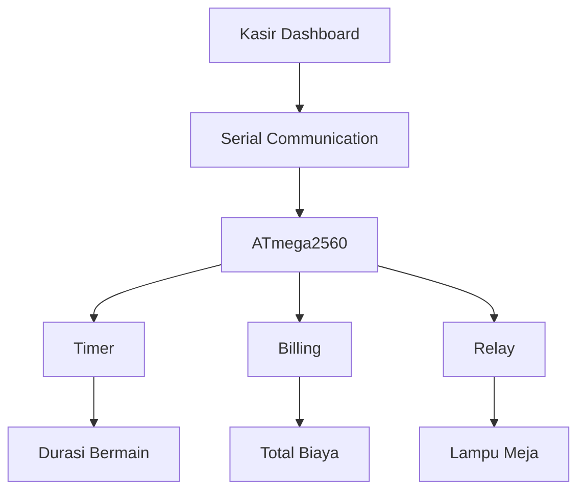

# 🎱 Smart Billiard Lighting & Billing System

> Integrasi Billing, Timer, dan Kontrol Lampu dalam Satu Sistem

Sistem berbasis ATmega2560 yang mengintegrasikan kontrol lampu meja biliar, timer permainan, dan perhitungan biaya sewa dalam satu dashboard kasir. Proyek ini bertujuan meningkatkan efisiensi operasional, mengurangi human error, dan meminimalkan pemborosan energi listrik.

---

📖 Overview

Smart Billiard Lighting & Billing System merupakan solusi otomatisasi untuk membantu pengelolaan arena biliar. Sistem menghubungkan aplikasi kasir dengan mikrokontroler ATmega2560 melalui komunikasi serial UART sehingga status penggunaan meja dapat dipantau dan dikendalikan secara real-time.

Selain mengontrol lampu meja secara otomatis, sistem juga mampu mencatat durasi bermain, menghitung biaya sewa berdasarkan tarif per menit, serta menyimpan riwayat transaksi.

---

🎯 Objectives
* **Mengurangi pemborosan energi listrik pada meja biliar.**
* **Mengotomatisasi pencatatan durasi bermain pelanggan.**
* **Menghitung biaya sewa secara otomatis berdasarkan waktu penggunaan.**
* **Mengurangi human error dalam operasional arena biliar.**
* **Meningkatkan efisiensi pengelolaan meja dan transaksi kasir.**

✨ Features

⏱ Real-Time Timer

Menampilkan durasi bermain setiap meja secara real-time.

💰 Flexible Pricing

Harga per menit dapat diatur sesuai kebutuhan operasional.

🧮 Automatic Billing

Total biaya dihitung otomatis berdasarkan durasi penggunaan meja.

💡 Smart Lighting Control

Lampu meja menyala dan mati mengikuti status penggunaan meja.

🎛 Manual & Automatic Mode

Mendukung pengoperasian secara otomatis maupun manual.

📊 Monitoring Dashboard

Menampilkan status meja, durasi bermain, dan total biaya dalam satu tampilan.

Main Workflow
* **Kasir memilih meja yang akan digunakan.**
* **Kasir mengatur tarif per menit.**
* **Sistem mengaktifkan timer dan lampu meja.**
* **Durasi bermain dihitung secara real-time.**
* **Sistem menghitung biaya berdasarkan durasi bermain.**
* **Saat sesi berakhir, lampu dimatikan otomatis.**
* **Riwayat transaksi disimpan pada sistem.**

## 👥 Tim Pengembang & Kontributor

| No | Nama Lengkap | NRP | Peran Utama & Fokus Jobdesk | GitHub Profile | Status Kontribusi |
| :---: | :--- | :---: | :--- | :--- | :---: |
| **1** | **Muh. Daffa Rizaldy H.** | 2124600004 | **Project Manager** • Manajemen linimasa & koordinasi integrasi sistem | [@mdaffarh005-arch](https://github.com/mdaffarh005-arch) | 🟢 Done Commit |
| **2** | **Moh Harudin Ali** | 2124600008 | **Software Engineer (Firmware)** • Pengodean logika kontrol pemutusan relay | [@Harudin31](https://github.com/Harudin31) | 🟢 Done Commit |
| **3** | **Achmad Rafie Febriansyah** | 2124600011 | **3D Designer** • Pemodelan objek 3D casing box komponen | [@rafiefebriansyahh](https://github.com/rafiefebriansyahh) | 🟢 Done Commit |
| **4** | **Imam Syaifudin** | 2124600015 | **Hardware Engineer** • Perancangan skematik dan desain PCB | [@imam603](https://github.com/imam603) | 🟢 Done Commit |
| **5** | **Muhammad Abdi Muhyi Umam** | 2124600023 | **UI/UX Designer** • Perancangan interface dashboard web kasir | [@abdiemuhyi](https://github.com/abdiemuhyi) | 🟢 Done Commit |
| **6** | **Gandhi Husein Albana** | 2124600026 | **Software Engineer (Web & DB)** • Pengembangan database & komunikasi serial | [@gandhialbana-art](https://github.com/gandhialbana-art) | 🟢 Done Commit |

---

## 📊 To Do List

### 🟡 On Progress

- [ ] Dashboard development
- [ ] Timer system implementation
- [ ] Automatic billing calculation
- [ ] Relay control integration
- [ ] Hardware assembly
- [ ] PCB design

### 🟢 Complete

**[x]Repository setup**
**[x]Git workflow configuration**
**[x]Initial system design**
**[x]Initial system planning**
**[x]Mind map & root cause analysis**
**[x]Team collaboration setup**

🌍 SDGs Impact

SDG 7 – Affordable and Clean Energy

Meningkatkan efisiensi penggunaan energi melalui sistem kontrol lampu otomatis.

SDG 12 – Responsible Consumption and Production

Mendorong penggunaan sumber daya listrik yang lebih efisien dan bertanggung jawab.

🛠 Development Tools

* **ATmega2560**
Wokwi Simulator
VS Code
GitHub
KiCad
Figma
Python Tkinter

📚 Course Information

* **Project Type:** Embedded System & IoT Project
* **Microcontroller:** ATmega2560
* **Development Tools:** Wokwi, VS Code, GitHub, KiCad, Figma

Smart Billiard Management System — Simplifying Operations Through Smart Automation.
